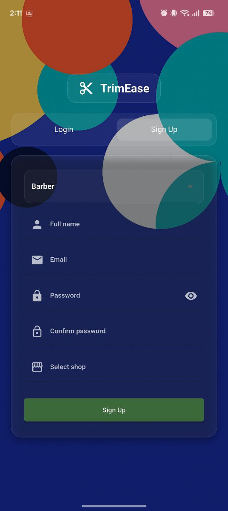
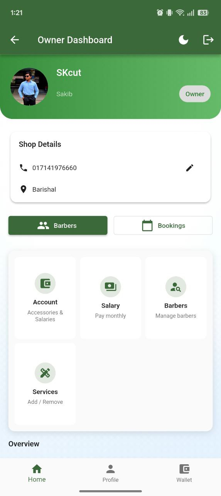
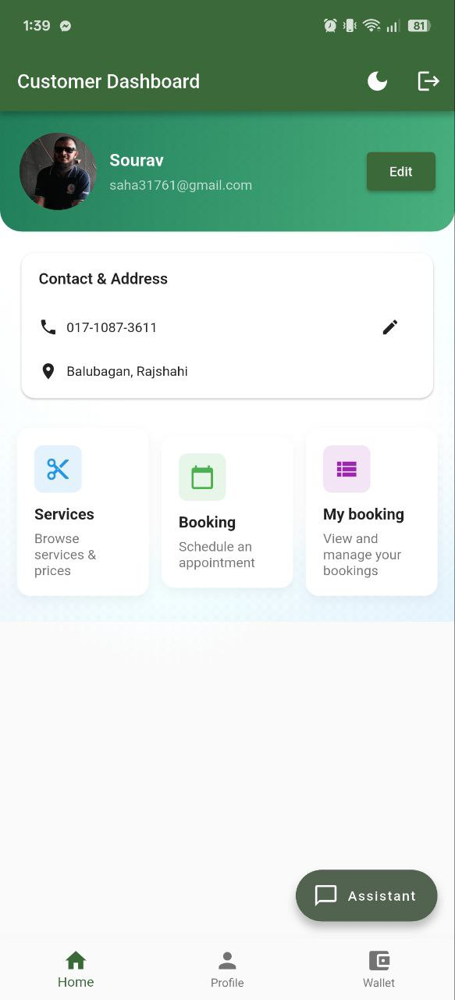
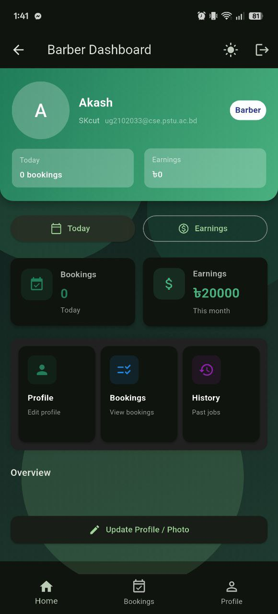
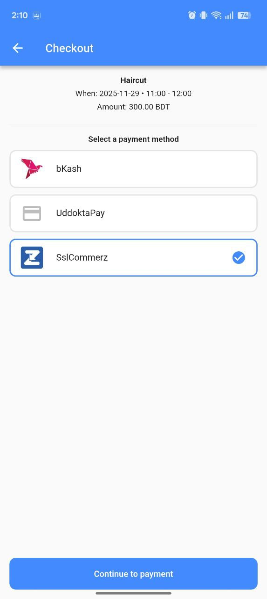

# TrimEase — Barber Booking App


[](LICENSE)

TrimEase is a Flutter application designed for barbershops and clients to manage bookings, profiles, and payments with a smooth, modern UI.

## Features

- Authentication with Firebase Auth
- Data persistence with Cloud Firestore
- Payment flows (Stripe, SSLCommerz)
- Cross‑platform: Android, iOS, Web, Desktop (macOS/Windows/Linux)
- Modular architecture with clear feature folders

## Tech Stack

- Flutter + Dart
- Firebase (Auth, Core, Firestore)
- Stripe, SSLCommerz integrations
- Workmanager, Shared Preferences, URL Launcher, Image Picker

## Project Structure

Quick overview

```
lib/
	config/
	features/
	models/
	payment/
	utils/
	views/
	widgets/
	main.dart
assets/
	animations/
	fonts/
	images/
```

<details>
<summary>Full project structure</summary>

```
.
├── analysis_options.yaml
├── cheatsheet_flutter_dart.md
├── devtools_options.yaml
├── firebase.json
├── pubspec.yaml
├── README.md
├── LICENSE
├── android/
├── ios/
├── linux/
├── macos/
├── windows/
├── web/
│   ├── index.html
│   ├── manifest.json
│   ├── favicon.png
│   └── icons/
├── assets/
│   ├── animations/
│   ├── fonts/
│   │   ├── OFL.txt
│   │   └── Pacifico-Regular.ttf
│   └── images/
│       └── .gitkeep
├── images/
│   ├── 12.jpg
│   ├── 3.jpg
│   ├── 4444.jpg
│   ├── 7.jpg
│   ├── 8.jpg
│   ├── Shop-Logo.png
│   ├── barber.png
│   ├── barber1.png
│   ├── beard.png
│   ├── bg.png
│   ├── boy.jpg
│   ├── cutting.png
│   ├── discount.png
│   ├── facials.png
│   ├── hair-color.png
│   ├── hair.png
│   ├── kids.png
│   ├── lotion.png
│   ├── me.jpg
│   ├── razor.png
│   ├── redcircle.png
│   ├── scissors.png
│   ├── shaving.png
│   ├── shaving2.png
│   ├── us.jpg
│   └── yellowcircle.png
├── lib/
│   ├── main.dart
│   ├── firebase_options.dart
│   ├── config/
│   │   └── cloudinary_config.dart
│   ├── models/
│   │   └── slot_context.dart
│   ├── payment/
│   │   ├── checkout.dart
│   │   └── payment_helper.dart
│   ├── utils/
│   │   ├── background_tasks.dart
│   │   ├── cloudinary_service.dart
│   │   ├── firebase_helper.dart
│   │   ├── firestore_pricing_queries.dart
│   │   ├── local_store.dart
│   │   └── theme_provider.dart
│   ├── views/
│   │   └── checkout/
│   │       └── checkout.dart
│   ├── widgets/
│   │   └── premium_background.dart
│   └── features/
│       ├── auth/
│       │   ├── provider/
│       │   │   └── auth_provider.dart
│       │   └── ui/
│       │       ├── auth_page.dart
│       │       ├── login_form.dart
│       │       ├── otp_widget.dart
│       │       └── signup_form.dart
│       ├── barber/
│       │   └── barber_dashboard.dart
│       ├── customer/
│       │   ├── booking_page.dart
│       │   ├── customer_chatbot.dart
│       │   ├── customer_dashboard.dart
│       │   ├── customer_profile.dart
│       │   ├── customer_wallet.dart
│       │   ├── detail_page.dart
│       │   ├── my_bookings.dart
│       │   └── services_page.dart
│       ├── owner/
│       │   ├── account_management.dart
│       │   ├── barber_management.dart
│       │   ├── owner_dashboard.dart
│       │   ├── owner_profile.dart
│       │   ├── owner_salary.dart
│       │   ├── owner_wallet.dart
│       │   └── service_management.dart
│       └── pricing/
│           ├── demand_calculator.dart
│           ├── pricing_cache.dart
│           ├── pricing_rules.dart
│           └── pricing_service.dart
├── test/
│   └── widget_test.dart
└── build/  (generated; omitted)
```

</details>

## Prerequisites

- Flutter SDK installed and on PATH
- Dart SDK (bundled with Flutter)
- Firebase project (already configured via `lib/firebase_options.dart`)

## Setup

1) Install dependencies

```
flutter pub get
```

2) Firebase configuration

- This repo includes `lib/firebase_options.dart` and Android `google-services.json`.
- If you need to reconfigure or add other platforms:

```
dart pub global activate flutterfire_cli
flutterfire configure
```

Ensure platform files exist:

- Android: `android/app/google-services.json`
- iOS: `ios/Runner/GoogleService-Info.plist`

## Run

```
flutter run
```

Select your desired device or use platform flags, e.g. `-d chrome` for Web.

## Build

- Android APK: `flutter build apk`
- Android AppBundle: `flutter build appbundle`
- iOS: `flutter build ios` (on macOS)
- Web: `flutter build web`
- Desktop: `flutter build macos | windows | linux`

## Tests

```
flutter test
```

## Screenshots

Add your screenshots to `images/` and reference them here.

| Home | Booking | Owner | Customer | Barber | Payments | Services |
|------|---------|-------|----------|--------|----------|----------|
|  |  |  |  |  |  |  |

## Contributing

Issues and PRs are welcome. Please fork, create a feature branch, and open a pull request with a clear description.

## License

This project is licensed under the MIT License — see the [LICENSE](LICENSE) file for details.
